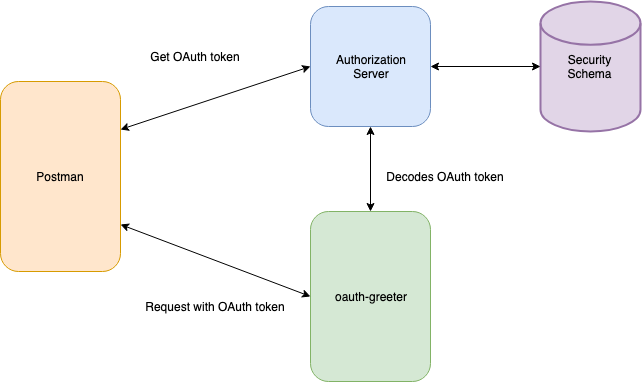
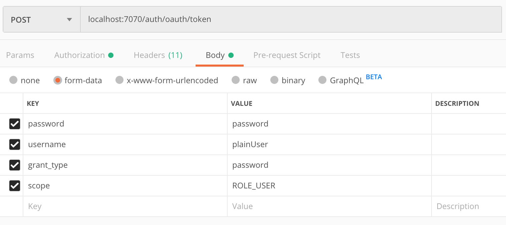
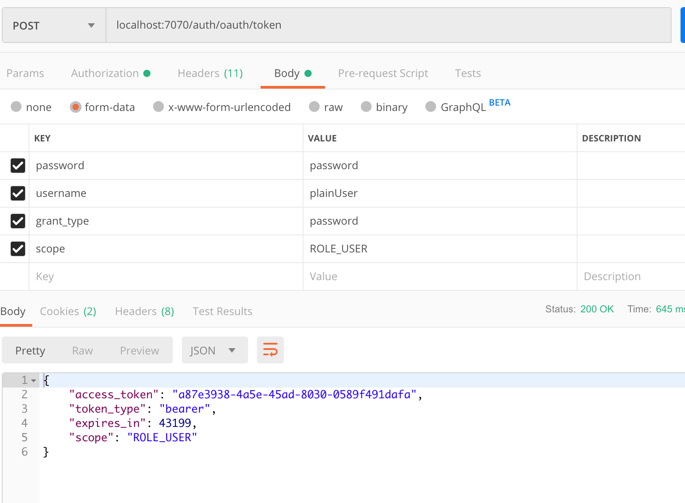
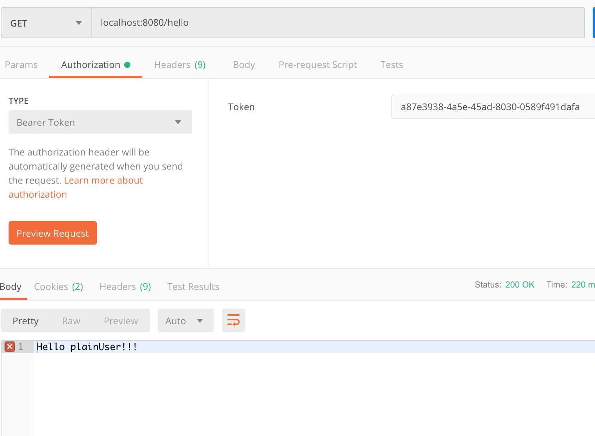

# OAuth 2 Tutorial

This tutorial shows you how to create an OAuth 2 authorization server that issues tokens for users contained in a Spring Security schema. The OAuth 2 token will then be used by a client to access a separate service. That service then validates the given token with the authorization server before granting access.

You will need:

* MySQL
* MySQL Workbench
* Spring Initializr (start.spring.io)
* IntelliJ IDEA Community Edition

## System Design

Oauth-greeter is a simple Hello World REST web service that requires a valid OAuth 2 token for access. When presented with an OAuth 2 token, the oaut-greeter calls the Authorization Server to validate the token. If the token is valie, access is granted, otherwise access is denied. The OAuth 2 token is provided to the client (Postman in our case) by the Authorization Server based on valid username/password and entries in the Security Schema. The client then sends this token along with the request to the oaut-greeter service.




## Building the System

We'll build the system in the following steps:

1. Create the Authorization Server project
2. Create the Spring Security schema
3. Add the @EnableResourceServer annotation
4. Configure authentication manager for Authorization Server
5. Configure Authorization Server clients and endpoints
6. Create User Info endpoint for Authorization Server
7. Create oauth-greeter project
8. Create oauth-greeter endpoint
9. Configure oath-greeter to use token and Authorization Server

### Step 1: Create Authorization Server Project

Step 1 is to create the Authorization Server.  We'll use the Spring Initializr to create our project. Go to ```start.spring.io``` and enter the following information:

- Group = com.trilogyed
- Artifact = authorization-service
- Dependencies = Spring Web Starter, JDBC API, MySQL Driver, Cloud OAuth 2

Download the project, copy it into your working directory, and open the project in IntelliJ.

### Step 2: Create Spring Security Schema

We will use the default schema supplied by Spring Security. For details on this schema and how it works, see the Spring Security Tutorial.

The following script creates the schema, the tables that hold users and authorities, and populates the tables with test users and authorities. Open MySQL Workbench and run the following script:

```sql
create schema if not exists auth_server;
use auth_server;

create table if not exists users(
	username varchar(50) not null primary key,
	password varchar(100) not null,
	enabled boolean not null
);

create table if not exists authorities (
	username varchar(50) not null,
	authority varchar(50) not null,
	constraint fk_authorities_users foreign key(username) references users(username));
	create unique index ix_auth_username on authorities (username,authority
);

insert into users (username, password, enabled) values ('plainUser', '$2a$10$KxTc8SYbIB/IaXCWz6NA4ug1pkAYM/e.P.0YQFGE3Ua4FZ6Qf842a', true);
insert into users (username, password, enabled) values ('managerUser', '$2a$10$QPnaeWBWz1BdDglni2CLzO2YMeifVXtQDPgUOVNETTcj8cEGwqiym', true);
insert into users (username, password, enabled) values ('adminUser', '$2a$10$Hc878CPLJ4hOtwyzt6V7..LHtzhcR3zqcXOAPseY9QGg05ZxcsTR6', true);

insert into authorities (username, authority) values ('plainUser', 'ROLE_USER');
insert into authorities (username, authority) values ('managerUser', 'ROLE_USER');
insert into authorities (username, authority) values ('managerUser', 'ROLE_MANAGER');
insert into authorities (username, authority) values ('adminUser', 'ROLE_USER');
insert into authorities (username, authority) values ('adminUser', 'ROLE_MANAGER');
insert into authorities (username, authority) values ('adminUser', 'ROLE_ADMIN');
```

At this point we also need to configure the data source so our server can talk to the database. Open the ```application.properties``` file and add the following:

```
spring.datasource.url: jdbc:mysql://localhost:3306/auth_server?useSSL=false
spring.datasource.username: root
spring.datasource.password: rootroot
spring.datasource.driver-class-name: com.mysql.jdbc.Driver

server.port=7070
security.sessions=never
server.servlet.context-path=/auth
```

Some items to note about these entries:

* The JDBC entries are standard.
* We're setting the port of the server to 7070.
* We're indicating that we don't want to use sessions.
* We've indicated that the context path for this application should be ```/auth```. This means that all endpoint paths for the application will be prepended with ```/auth```.

### Step 3: Add @EnableResourceServer Annotation

Now we will add the @EnableResourceServer annotation to the AuthorizationServiceApplication class. This enables the resource server features for this application:

```java
@SpringBootApplication
@EnableResourceServer
public class AuthorizationServiceApplication {

	public static void main(String[] args) {
		SpringApplication.run(AuthorizationServiceApplication.class, args);
	}
}
```


### Step 4: Configure Authentication Manager for Authorization Server

Next, we will configure the Authorization Server to use the security schema created in the previous step. Create a new Java class called ```com.trilogyed.authorizationservice.SecurityConfig``` and add the following code:

```java
@Configuration
@EnableWebSecurity
public class SecurityConfig extends WebSecurityConfigurerAdapter {

    @Autowired
    DataSource dataSource;

    @Autowired
    public void configAuthentication(AuthenticationManagerBuilder authBuilder) throws Exception {

        PasswordEncoder encoder = new BCryptPasswordEncoder();

        authBuilder.jdbcAuthentication()
                .dataSource(dataSource)
                .usersByUsernameQuery(
          "select username, password, enabled from users where username = ?")
                .authoritiesByUsernameQuery(
          "select username, authority from authorities where username = ?")
                .passwordEncoder(encoder);

    }

    @Bean
    public BCryptPasswordEncoder passwordEncoder() {
        return new BCryptPasswordEncoder();
    }

    @Bean
    @Override
    public AuthenticationManager authenticationManagerBean() throws Exception {
        AuthenticationManager am = super.authenticationManagerBean();
        return am;
    }
}
```

Some items to note about this code:

* The ```dataSource``` and ```configureAuthentication``` are identical to the configuration used in the Spring Security Tutorial. See that tutorial for details.
* We expose the password encoder and authentication manager as Beans so they can be used to configure the Authorization Server clients and endpoints.

### Step 5: Configure Authorization Server Clients and Endpoints

Now we will configure the Authorization Server itself. This will be done in two steps:

1. Configure the OAuth clients
2. Configure the endpoints

##### 4.1 Configure OAuth Clients

Now we will configure the OAuth clients that the Authorization Service will accept. Create a new Java class called ```com.trilogyed.authorizationservice.OAuthConfig``` and add the following code:

```java
@Configuration
@EnableAuthorizationServer
public class OAuthConfg  extends AuthorizationServerConfigurerAdapter {

    @Override
    public void configure(ClientDetailsServiceConfigurer clients) throws Exception {

        clients.inMemory()
                .withClient("html5")
                .authorizedGrantTypes("password")
                .scopes("ROLE_USER", "ROLE_MANAGER", "ROLE_ADMIN")
                .secret("$2a$10$0Mf57EA3kipR1ej14v/tpeZ5UvV7kmcym57hfztwF79seJc.ulnHS");
    }
}
```

In this code we register one client called ```html5``` with the Authorization Server. We configure this client with the following attributes:

* Since this is a configuration class we must annotate it with ```@Configuration```.
* We use the ```@EnableAuthorizationServer``` annotation to turn on the Authorization Server features.
* This client is allowed to use the OAuth 2 ```password``` flow. 
* This client is given the ```ROLE_USER```, ```ROLE_MANAGER```, and ```ROLE_ADMIN``` authorities.
* The client has a secret (this is somewhat like a password) with the value of ```app_secret``` that is hashed using BCrypt.

##### 4.2 Configure Endpoints

Endpoints are also configured in the OAuthConfig class created in the previous step.  Modify your OAuthConfig class so it looks like this:

```java
@Configuration
@EnableAuthorizationServer
public class OAuthConfg  extends AuthorizationServerConfigurerAdapter {

    private AuthenticationManager authenticationManager;

    @Autowired
    public OAuthConfg(AuthenticationManager authenticationManager) {
        this.authenticationManager = authenticationManager;
    }

    @Override
    public void configure(ClientDetailsServiceConfigurer clients) throws Exception {

        clients.inMemory()
                .withClient("html5")
                .authorizedGrantTypes("password")
                .scopes("ROLE_USER", "ROLE_MANAGER", "ROLE_ADMIN")
                .secret("$2a$10$0Mf57EA3kipR1ej14v/tpeZ5UvV7kmcym57hfztwF79seJc.ulnHS");
    }

    @Override
    public void configure(AuthorizationServerEndpointsConfigurer endpoints) throws Exception {
        endpoints.authenticationManager(this.authenticationManager);
    }
}
```

Some items to note about this code:

* We inject the AuthenticationManger that we created and exposed as a Bean earlier.
* We pass the injected AuthenticationManager to our endpoints configuration so that the Authentication Manager can be used to protect the endpoints of the Authorization Server.

### Step 6: Create User Info Endpoint for Authorization Server

Now we need to create an endpoint on the Authorization Server where client applications (like oauth-greeter) can validate their tokens and get the user data associated with the token. Create a new Java class called ```com.trilogyed.authorizationservice.controller.UserInfoController``` and add the following code:

```java
@RestController
public class UserInfoController {

    @RequestMapping(value = "/userinfo", method = RequestMethod.GET)
    public Principal getUserInfo(Principal principal) {
        System.out.println("CALLED userinfo");
        return principal;
    }
}

```

Things to note about this code:

* This is a simple REST endpoint.
* Spring Security will inject the Principal associated with the token.
* The endpoint returns the Principal

### Step 7: Create oath-greeter Project

Now that the Authorization Server is created we will create a simple web service that uses it.

We'll use the Spring Initializr to create our project. Go to ```start.spring.io``` and enter the following information:

- Group = com.trilogyed
- Artifact = oauth-greeter
- Dependencies = Spring Web Starter, Cloud OAuth 2

Download the project, copy it into your working directory, and open the project in IntelliJ.

### Step 8: Create Enpoint for oauth-greeter

The next step is to create a REST endpoint for our service so we can demonstrate how this system works. Create a new Java class called ```com.trilogyed.oauthgreeter.controller.GreeterController``` and add the following code:

```java
@RestController
public class GreeterController {

    @RequestMapping(value = "/hello", method = RequestMethod.GET)
    public String hello(Principal principal) {

        return "Hello " + principal.getName() + "!!!";
    }
}
```

Items to note about this code:

* This is a standard REST endpoint.
* We will rely on Spring Security to inject a Principal into this method. The sequence of events is:
  * The client application (Postman) make a GET request to this endpoint. The request includes an OAuth token.
  * When the request is received, the oath-greeter application sends the token to the Authorization Server for validation and retrieval of the user's information.
  * If the token is valid, the Authorization Server sends back the user's as a JSON representation of a Principal object (this is done by the ```userinfo``` endpoint that we created on the Authorization Service).
  * Spring (in the oauth-greeter) service gets the JSON representation of the Principal, converts it to a Principal object, and injects it into this method.

### Step 9: Configure oauth-greeter to Use Token and Authorization Server

Finally, we need to configure the oauth-greeter to use tokens and access the Authorization Server.

First, open the ```OAuthGreeterApplication``` class and add the ```@EnableResourceServer``` annotation. This tells the application that to use OAuth.

Second, we need to tell our application the location to get user info from the Authorization Server. Open the ```application.properties``` file and add the following entry:

```
security.oauth2.resource.user-info-uri=http://localhost:7070/auth/userinfo
```

Note that this is the ```userinfo``` endpoint on the Authorization Server that we created in a previous step.

## Exercising the System

Now it is time to exercise the system. We'll do this in two steps:

1. Ask the Authorization Server for a bearer token.
2. Send a request to the Resource Server (oauth-greeter) that includes the bearer token.

##### Requesting a Bearer Token

We request a bearer token from the Authorization Server by sending a POST to ```localhost:7070/auth/oauth/token```. This is a standard endpoint provided by Spring OAuth. Our POST request must include two things:

1. HTTP Basic authorization headers that contain the client id and client secret.
2. A form data containing:
   1. The username and password for the user that is requesting access.
   2. The grant type we're requesting (our application only supports 'password')
   3. The scope or authorities we're requesting.

Open Postman and create a POST request as shown in the following two images. The first image shows how to set the authorization headers. The second image shows how to set the form data.





You should get the following result when you submit this request:



##### Send a Request to the Resource Server

Now we will send a request to the Resource Server that includes the token. The Resource server will ask the Authorization Server to validate the token and send back user information. The endpoint uses that returned information to display the user's name in the response.

Our request to the Resource Server must include the token we just got from the Authorization Server. We include the token in the authorization headers under the Bearer Token type. Make the following request to the Resource Server and you show get the result shown:

