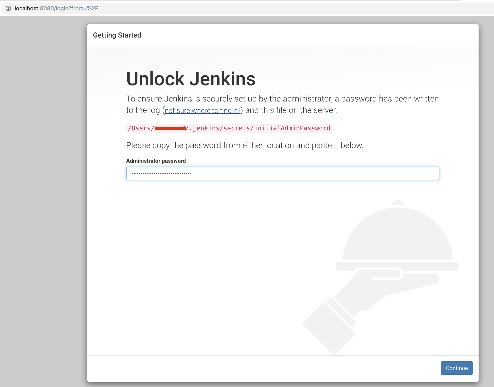
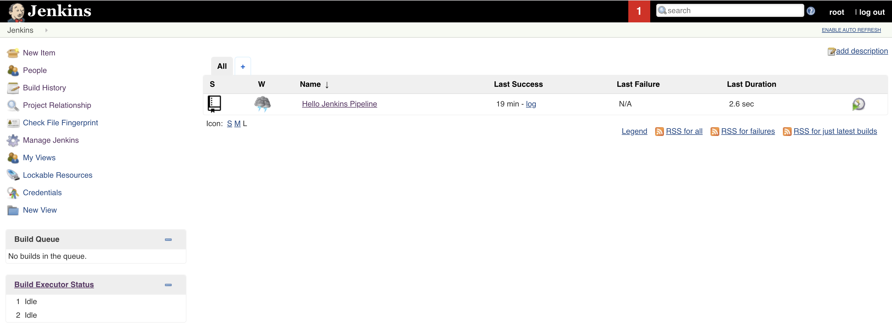

# Jenkins/Spring Boot Tutorial

This tutorial steps you through the creation of a Jenkins pipeline for an existing Spring Boot web service project.

You will need:

* A private GitHub repository for this project
* Java 8 (or greater)
* MySQL Server
* MySQL Workbench
* IntelliJ IDEA Community Edition
* Terminal (Mac) or Command Prompt (Windows)
* Jenkins Server (set up as part of this tutorial)

## Background

Jenkins is an open source server that is used to automate continuous integration and continuous delivery tasks in the software development process.

The Pipeline (with a captital P) is the abstraction that Jenkins uses to define and automate continuous integration and continuous delivery processes. A Pipeline consists of various software plugins and a **Jenkinsfile** that defines the Pipeline and specifies its behavior.

### Pipeline Design

We will create and configure a Pipeline for an existing RSVP web service consisting of the following stages:

1. Build - compiles the project
2. Test - runs the unit and integration tests
3. Deliver - packages the project

## Creating the Pipeline

We will create the Jenkins pipeline for this project in the following steps:

1. Jenkins installation
2. Create a new GitHub repo and configure and commit RSVP service source code
3. Pipeline creation
4. Pipeline execution

### Step 1: Jenkins Installation

Our first step is to download, install, and configure Jenkins.

#### 1.1: Download Jenkins

Go to https://jenkins.io/download/ and select Generic Java package (.war) under the Long-term Support (LTS) column as shown here:


Download this file to your Desktop folder.

#### 1.2: Install Jenkins

Now open a terminal or command prompt and navigate to your Desktop directory and issue the following command:

```bash
java -jar jenkins.war --httpPort=8080
```

This will start Jenkins on port 8080 and kick off the installation process. You will need the generated password for the Admin user to proceed. Scan your terminal/command prompt output for the following message and copy the generated password before navigating to http://localhost:8080 (note that your password will be different than the password in the image below):


Type this password in as the Administrator password when prompted on the Unlock Jenkins screen and click Continue:



Now click on Install suggested plugins:


Select Retry for any plugins that fail to install initially. 

The installer will now prompt you to create an Admin User. Supply the following values and click Save and Continue:

Username: root

Password: root

Full Name: root

E-mail Address: root@root.root


Leave the default value for Jenkins URL on the next screen and click Save and Finish:


Your installation is complete! Click on the Start using Jenkins button:


Go back to your terminal or command prompt and shut down Jenkins by entering Ctrl-C. Restart Jenkins by issuing the following command:

```bash
java -jar jenkins.war --httpPort=8080
```

Now visit http://localhost:8080. Login using the admin user credentials (username: root, password:root) that you setup earlier.

### Step 2: Create GitHub Repo and Configure and Commit RSVP Service Source

#### 2.1 Create New GitHub Repo

Now create a new GitHub repo called **Hello Jenkins**. Include a README file and create a .gitignore with basic Java entries. 

#### 2.2 Update .gitignore

Next, update the .gitignore file so that it looks like this. Note that additional lines are added to the end of this file that are not a part of the default java .gitignore: 

```
# Compiled class file
*.class

# Log file
*.log

# BlueJ files
*.ctxt

# Mobile Tools for Java (J2ME)
.mtj.tmp/

# Package Files #
*.jar
*.war
*.nar
*.ear
*.zip
*.tar.gz
*.rar

# virtual machine crash logs, see http://www.java.com/en/download/help/error_hotspot.xml
hs_err_pid*

target/

.DS_Store

.idea/
*.iml
```

This will prevent non-source files from being committed to your repo.

#### 2.3 Copy Source Into Repo

Now copy the folder ```rsvp-service``` into your repo. This folder will be given to you by your instructional staff. Commit and push these changes.

#### 2.4 Create the MySQL Database

The RSVP Service is backed by a MySQL database. The schema and database creation script is contained in the ```resources``` folder and is shown below for convenience. Note that the script creates two schemas: a regular schema (jenkins_rsvp) and a test schema (jenkins_rsvp_test). Open MySQL Workbench and run this script to create the schema and database:

```sql
create schema if not exists jenkins_rsvp;
use jenkins_rsvp;

create table if not exists rsvp (
	rsvp_id int not null auto_increment primary key,
    guest_name varchar(50) not null,
    total_attending int not null
);

create schema if not exists jenkins_rsvp_test;
use jenkins_rsvp_test;

create table if not exists rsvp (
	rsvp_id int not null auto_increment primary key,
    guest_name varchar(50) not null,
    total_attending int not null
);
```

The database connection information in the ```application.properties``` file is set to the following. Make any changes necessary for your configuration:

##### jenkins_rsvp database

```properties
spring.datasource.url: jdbc:mysql://localhost:3306/jenkins_rsvp?useSSL=false
spring.datasource.username: root
spring.datasource.password: rootroot
spring.datasource.driver-class-name: com.mysql.jdbc.Driver
```

##### jenkins_rsvp_test database

```properties
spring.datasource.url: jdbc:mysql://localhost:3306/jenkins_rsvp_test?useSSL=false
spring.datasource.username: root
spring.datasource.password: rootroot
spring.datasource.driver-class-name: com.mysql.jdbc.Driver
```

Now run the RsvpDaoTest unit test (found at ```rsvp-service-> src -> test -> java -> com -> trilogy -> rsvp -> dao```) to verify that your connection information, schema, and database definition are all correct.

Commit and push and changes that you made.

### Step 3: Create the Pipeline

There are two parts to this step:

1. Creating the Jenkinsfile containing the Pipeline instructions
2. Creating the Pipeline in the Jenkins user interface

#### 3.1 Create the Jenkinsfile

The Jenkinsfile defines the behavior of the Pipeline. A Jenkinsfile can be quite complex and can be written in Declarative or Scripted syntax. We will create a fairly simple Declarative Jenkinsfile. Declarative files are straightforward and suffice for most simple projects.

A Declarative Jenkinsfile requires at minimum five directives:

1. ```pipeline``` - this is the required container directive for the Jenkins file.
2. ```agent``` - this directive tells Jenkins to create a workspace and allocate an executor to run the Pipeline. Without an agent, the Pipeline cannot run. The agent is also responsible for checking out the source code for the project from the repository. The details of the repository access are configured through the Jenkins UI. We will do that in the next step.
3. ```stages``` - this is the container directive for all of the stages of the Pipeline.
   1. ```stage```- this directive holds the definition for a stage of the Pipeline. For example ```build``` or ```test```.
      1. ```steps``` - this directive contains the specific commands to be run for a particular stage. In our example these are all shell (Mac) or batch (Windows) commands.

Create a new file called ```Jenkinsfile``` (note the capital J) in the root of your project and copy the following content (use the appropriate file for your operating system).

##### Mac

```groovy
pipeline {
    agent any

    stages {

        stage('build') {
            steps {
              sh '''
                 cd ./rsvp-service
                 ./mvnw -DskipTests clean compile
              '''
            }
        }

        stage('test') {
            steps {
              sh '''
                 cd rsvp-service
                     ./mvnw test
              '''
            }
        }

        stage('deliver') {
            steps {
              sh '''
                 cd rsvp-service
                     ./mvnw -DskipTests install
              '''
            }
        }

    }
}
```


##### Windows

```groovy
pipeline {
    agent any

    stages {

        stage('build') {
            steps {
              bat '''
                 cd rsvp-service
                 ./mvnw -DskipTests clean compile
              '''
            }
        }

        stage('test') {
            steps {
              bat '''
                 cd rsvp-service
                     ./mvnw test
              '''
            }
        }

        stage('deliver') {
            steps {
              bat '''
                 cd rsvp-service
                     ./mvnw -DskipTests install
              '''
            }
        }

    }
}
```

Some items to note about the Jenkinsfile:

* We don't have any special requirements for running this Pipeline so we specify ```any``` for the agent, which allows Jenkins to use the default.
* The file contains three stages: ```build```, ```test```, and ```deliver```.
* Each ```stage``` has one ```steps``` directive which consists of shell or batch commands. The use of ```sh``` (Mac) or ```bat``` (Windows) allows us to run shell or batch commands. Wrapping  the shell or batch commands in ```'''``` allows us to run more than one command at a time. This is crucial in our case because we need to change directories and then execute another command. 
* Each ```stage``` of our Pipeline consists of running Maven commands using the Maven instance included in our project by the Spring Initializr (mvnw).

**Commit your changes and push them to your GitHub repository.**

#### 3.2 Create Pipeline in Jenkins UI

Now we will create the Pipeline in the Jenkins UI. If you haven't already done so, start your Jenkins server with the following command:

```bash
java -jar jenkins.war --httpPort=8080
```

Visit http://localhost:8080 and login. You should see the following screen:


Click on the "create new jobs" link to display the following screen:


Enter ```Hello Jenkins Pipeline``` for the item name, select Multibranch Pipeline, and click OK. You should see the following screen:


##### General

Enter ```Hello Jenkins Pipeline``` for the display name.

Enter ```Demo Pipeline project for RSVP service``` for the description.

##### Branch Sources

The Branch Sources section allows us to configure access to the repository that holds our project source code and our Jenkinsfile.

Click on the Add source button and choose GitHub to display the following:


Click the Add button (next to the Credentials label) and select Hello Jenkins Pipeline. You should see the following:


Enter the following values:

**Domain**: leave at Global credentials

**Kind**: Leave at Username with password

**Username**: the username to the repo containing the RSVP source code and Jenkinsfile

**Password**: the password to the repo containing the RSVP source code and Jenkinsfile

**ID**: Leave blank, the system will generate an ID

**Description**: Credentials for Hello Jenkins repository

Click the Add button. You should now see something similar to this:


Click on the -none- select box and choose the credentials that you just entered. You should now see something similar to this:


Next we need to enter the URL for the repository containing the RSVP source code and Jenkinsfile. Enter the URL to your repository and click the Validate button. You should see something similar to this:


##### Leave the rest of the settings at their default values.

##### Click Save

If everything is configured correctly, you should see something similar to this:


You will see error messages on this screen if everything is not configured correctly. Read the error messages, debug the problem(s), and double check your configuration against the tutorial. Ask your instructional staff for help if needed.

### Step 4: Pipeline Execution

We can now execute the Pipeline in Jenkins. Click the Jenkins logo in the upper left hand corner of the screen to display the Jenkins home screen. You should see something similar to this:



Click on the Hello Jenkins Pipeline link. You should see the following screen:


Click on the to the far right of the Pipeline entry (as circled in red above) to schedule a build for the master branch.

Jenkins will schedule and run your Pipeline. You will see activity under the Build Queue and Build Executor Status headings at the bottom left of the screen.

You will see an update under the Last Success header if your build of a success. If the build failed, you will see an update under the Last Failure heading. You can see the complete log output for both successful and failed builds. This is very useful in debugging issues with your failed builds. To view the logs, click the Console Output menu item as shown in the following image:


If your build was successful - Congratulations! You have created and run your first Jenkins Pipeline.

If you build was unsuccessful, please view the Console Log output and address any issues. Ask your instructional staff for help if needed.
